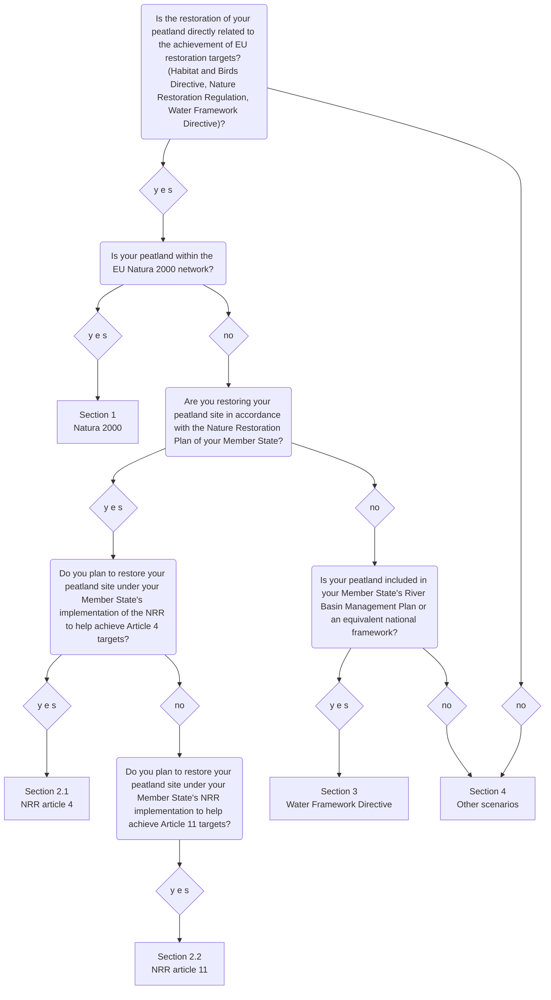

# 3. Funding options for peatland restoration 
## 3.1 Introduction
The following Decision Support System (DSS) is meant for all landowners and practitioners within the European Union interested in restoring their peatland and accessing financial support for it. With the help of the following DSS, one can get information on available funding options for the restoration and rewetting of peatland sites in the European Union.

<strong>Figure 1.</strong>  Decision support flowchart for peatland restoration within the European Union.

### 3.2.1 Section 1: Natura 2000 network
The Birds Directive (Directive 2009/147/EC on the conservation of wild birds (referred to as Birds Directive 2009/147/EC); adopted 1979)<a class="fnref" id="ref-1-origin" href="#fn-1">[1]</a> and the Habitats Directive (Council Directive 92/43/EEC on the conservation of natural habitats and of wild fauna and flora (referred to as Habitat Directive (92/43/EEC); adopted 1992)<a class="fnref" id="ref-2-origin" href="#fn-2">[2]</a> are the oldest EU nature conservation policies, designed to protect wild birds, habitats, and species across Europe. Together, they form the Natura 2000 network, which aims to prevent habitat degradation and ensure the maintenance or restoration of favourable conservation status (FCS) for species and habitats of community interest, within which peatlands and other wetlands figure prominently (Habitat Directive (92/43/EEC), Peters & von Unger (2017)).<a class="fnref" id="ref-2b-origin" href="#fn-2">[2]</a>,<a class="fnref" id="ref-3-origin" href="#fn-3">[3]</a>

Within the Natura 2000 network, two main categories of protected sites are designated: Special Areas of Conservation (SACs) and Special Protection Areas (SPAs), respectively targeting habitat types listed in Annex I (raised bogs, fens, mires) as well as Species listed in Annex II (plant, amphibians, insects), and bird species listed in Annex I (cranes, raptors, waders) as well as migratory birds, both dependent on wetlands and peatlands Habitat Directive (92/43/EEC).<a class="fnref" id="ref-2c-origin" href="#fn-2">[2]</a>; Birds Directive (Directive 2009/147/EC)<a class="fnref" id="ref-1b-origin" href="#fn-1">[1]</a>

**Natura 2000 Funding Alignment Wizard**

Use this interactive wizard to determine if your site falls under statutory Natura 2000 obligations and to identify the primary financing streams available for your project. By answering the targeted routing questions, you will map out your site's eligibility for targeted core programs.


### 3.2.2 Section 2.1: Nature Restoration Regulation, Art. 4
The Nature Restoration Regulation (NRR)<a class="fnref" id="ref-4-origin" href="#fn-4">[4]</a>, adopted in 2024, aims at expanding the scope of restoration measures beyond Natura 2000 sites. The NRR sets legally binding targets that include all habitat types listed in Annex I of the Habitat Directive in poor or bad condition, from urban to marine or terrestrial ecosystems.

As part of the Nature Restoration Regulation, EU Member States are required to prepare a National Restoration Plan (NRP) and carry out the preparatory monitoring and research needed to identify the restoration measures that are necessary to meet the NRR restoration targets and fulfil the obligations set in article 4 to 13 of the Regulation in the respective Member State. Across those articles, peatland restoration is mandated in articles 4 and 11 Regulation (EU) 2024/1991 on nature restoration (referred to as NRR (EU 2024/1991)).<a class="fnref" id="ref-4b-origin" href="#fn-4">[4]</a> 

Article 4 of the Nature Restoration Regulation mandates that:
* At least 30% of Annex I habitat area in bad condition must be restored **by 2030**
* At least 60% by 2040
* At least 90% by 2050
Until 2030, the Nature Restoration Regulation highlights that Member States should give priority to restoration measures in areas located in Natura 2000 sites (NRR (EU 2024/1991)).<a class="fnref" id="ref-4c-origin" href="#fn-4">[4]</a>

**NRR Article 4 Diagnostic Wizard**

This step-by-step diagnostic wizard evaluates your project's status against the legally binding timeline targets mandated by Article 4 of the Nature Restoration Regulation. It calculates whether your proposed works constitute a mandatory statutory requirement or an eligible voluntary extension, routing you to the corresponding public or private financing frameworks.


### 3.2.3 Section 2.2: Nature Restoration Regulation, Art. 11
The Nature Restoration Regulation (NRR)<a class="fnref" id="ref-4d-origin" href="#fn-4">[4]</a>, adopted in 2024, aims at expanding the scope of restoration measures beyond Natura 2000 sites. The NRR sets legally binding targets that include all habitat types listed in Annex I of the Habitat Directive in poor or bad condition, from urban to marine or terrestrial ecosystems.
As part of the Nature Restoration Regulation, EU Member States are required prepare a National Restoration Plan (NRP) and carry out the preparatory monitoring and research needed to identify the restoration measures that are necessary to meet the restoration targets and fulfil the obligations set in article 4 to 13 of the Regulation. Across those articles, peatland restoration is mandated in two: article 4 and article 11 (NRR (EU 2024/1991)).<a class="fnref" id="ref-4e-origin" href="#fn-4">[4]</a>

Article 11 of the Nature Restoration Regulation is targeting especially peatlands under agriculture use, mandating that:
* 30% of drained peatlands under agricultural use should be restored by 2030, of which at least a quarter shall be rewetted.
* 40% of such area by 2040, of which at least a third shall be rewetted.
* 50% of such area by 2050, of which at least a third shall be rewetted.

However, Member States are allowed to put in place restoration measures, including rewetting, in areas of peat extraction sites and count those areas as contributing to meeting these targets. In addition, the restoration/rewetting of drained peatlands under other land uses such as forest lands is allowed to contribute to them up to a maximum of 40% (NRR (EU 2024/1991)).<a class="fnref" id="ref-4f-origin" href="#fn-4">[4]</a>

**NRR Article 11 Agricultural & Forestry Wizard**

Because Article 11 specifically targets drained peatlands under active agricultural or forestry use, funding eligibility shifts based on Common Agricultural Policy (CAP) integration and land-use history. Navigate the questions below to isolate your exact funding pathway, factoring in national rewetting thresholds and land-use allowances.


### 3.2.4 Section 3: Water Framework Directive
The Water Framework Directive (Directive 2000/60/EC) on establishing a framework for Community action in the field of water policy (referred to as WFD (2000/60/EC))<a class="fnref" id="ref-5-origin" href="#fn-5">[5]</a> is an EU Directive designed to achieve good ecological and chemical status in all surface water bodies, as well as good status for groundwater, across the European Union. For each river basin, which can include a variety of water bodies (rivers, lakes, coastal waters., etc.) a River Basin Management Plan (RBMP) must be created and renewed every six years. The RBMP assesses the water status of the basin, sets environmental objectives and includes the development of a Programme of Measures (PoM) to achieve those objectives (WFD (2000/60/EC)).<a class="fnref" id="ref-5b-origin" href="#fn-5">[5]</a>

Even though peatlands are not considered as separate water bodies under the WFD, they influence surrounding water bodies and associated river basins hydrologically. In some circumstances, peatland management measures, included as basic or supplementary measures in the PoM, may be a necessary measure to achieve the objectives of the WFD. In such cases, peatland restoration and re-creation (sensu restoration) may be made binding through legal obligations or restrictions under local, regional or national law or remain non-binding and supported through voluntary funding schemes within the PoM.

**Water Framework Directive (WFD) Integration Wizard**

This interactive wizard analyzes how your local peatland hydrology interacts with broader river basin objectives. By tracing whether your restoration works are embedded as basic or supplementary measures within a regional framework, the tool identifies whether your funding path relies on mandatory legal compliance funds or voluntary water-quality incentive schemes.


### 3.2.5 Section 4: Other Scenarios
Even if peatland restoration is not directly mandated by the Water Framework Directive, the Nature Restoration Regulation, or the Birds and Habitats Directives, it nevertheless contributes to the Nature Restoration Regulation objectives while delivering a wide range of ecosystem services and local co-benefits. Participating in restoration projects or relevant agri-environment schemes can provide you substantial financial support to compensate for income loss.
Although EU funds are often prioritized for restoration measures linked to EU environmental targets under the Habitats and Birds Directives, the Nature Restoration Regulation, or the Water Framework Directive, they can still support voluntary or independent restoration initiatives.

**Voluntary & Ecosystem Services Funding Wizard**

If your site sits outside of statutory mandates, financial viability relies on voluntary mechanisms, eco-schemes, and private ecosystem service markets. Use this final routing wizard to evaluate how your independent project can leverage competitive EU supplementary funds, national policy portals, or private carbon farming certification programs to offset income loss and fund capital works.


## 3.3 Description of Funding Schemes

### Public EU Funds
#### Cohesion Policy Funds
The **European Regional and Development Fund (ERDF)** can fund projects that enhance the protection and preservation of nature, biodiversity and green infrastructure in all Member States, with 30% of its budget allocated to climate objectives (EC, 2022).<a class="fnref" id="ref-6-origin" href="#fn-6">[6]</a>
The **Cohesion Fund (CF)** on the other hand, is allocated only to countries with Gross National Income below 90% EU average. It is meant to support them in reaching their environmental obligations, especially in waste and water management, but also includes nature restoration measures (EC, 2025).<a class="fnref" id="ref-7-origin" href="#fn-7">[7]</a>
Lastly, the **Just Transition Fund (JTF)** is supporting, in the context of peatland restoration, measures such as phasing out the use of peat in energy or restoring peatland habitats of EU importance (EC, 2025).<a class="fnref" id="ref-7b-origin" href="#fn-7">[7]</a>
The extent to which these funds support peatland restoration depends largely on Member State priorities. To assess whether your country allocates funding to peatland restoration, consult the Inforegio - Programmes.

#### Common Agricultural Policy (CAP) funds: Natura 2000 payments, eco-schemes and agri-environmental climate measures
Under Pillar I of the 2023-2027 Common Agricultural Policy, farmers may receive direct payments through **voluntary eco-schemes** (EC, 2022).<a class="fnref" id="ref-6b-origin" href="#fn-6">[6]</a> Eco-schemes are annual arrangements that incentivize farmers introducing voluntary farming practices contributing to the EU's environmental and climate objectives, including practices like rewetting peatlands and paludiculture (Mathias, 2022).<a class="fnref" id="ref-8-origin" href="#fn-8">[8]</a>
Under Pillar II, support is provided through:
* **Natura 2000 compensation payments**, which compensate landowners for costs incurred and income loss due to conservation obligations (Anougmar et al., 2025)<a class="fnref" id="ref-9-origin" href="#fn-9">[9]</a>
* **INVEST interventions**, or one time funding for productive and non-productive long-term structural changes, such as the establishment of restoration of landscape features, peatland rewetting and habitat restoration (Meier et al., 2025)<a class="fnref" id="ref-10-origin" href="#fn-10">[10]</a>
* **Agri-environment-climate measures (AECMs)**, which are multi-annual support schemes incentivizing farmers to manage their land using environmentally friendly practices going beyond conditionality (ebd.)
The extent to which these funds support peatland restoration depends largely on Member State programming and co-funding. To assess whether your country allocates funding to peatland restoration, consult its national CAP Strategic Plans.

#### LIFE Programme
LIFE (L’Instrument Financier pour l’Environnement) is the European Union’s funding programme for environmental, nature and climate protection. It supports projects that promote sustainable solutions and put environmental policy into practice (BMUKN, 2026).
In the case of peatland restoration, LIFE projects provide support for rewetting drained peatlands, restoring native vegetation, and implementing conservation measures that contribute to biodiversity and climate mitigation through innovative practices (LIFE Peat Restore, 2017; EC, 2022b).<a class="fnref" id="ref-11-origin" href="#fn-11">[11]</a>,<a class="fnref" id="ref-12-origin" href="#fn-12">[12]</a> Landowners’ participation is supported through compensation payments for income foregone and additional costs linked to conservation and management measures (CINEA, 2021).<a class="fnref" id="ref-13-origin" href="#fn-13">[13]</a>

#### Recovery and Resilience Facility (RRF)
The Recovery and Resilience Facility  is a funding instrument of the NextGenerationEU. At least 37% of its budget must be allocated to green transition measures, which may include biodiversity protection and restoration measures. Those measures can be found in Member States’ national Recovery and Resilience Plan (RRP) (EC, 2022b).<a class="fnref" id="ref-12b-origin" href="#fn-12">[12]</a>
The extent to which these funds support peatland restoration depends largely on Member State priorities. To assess whether your country allocates funding to peatland restoration through its Recovery and Resilience Plan, consult the Country pages on Reforms and Investments by the European Commission.

### Public National Funds

Public National Funds, embedded as financing mechanism for peatland restoration within the frameworks of the Water Framework Directive (WFD), the Nature Restoration Regulation (NRR), and the Natura 2000 network, are implemented through distinct national budgets and planning priorities that vary from one Member State to another.
Under the WFD, River Basin Management Plans explicitly allocate national resources to restore the hydrological integrity of peatlands to achieve "good ecological status" for associated water bodies (EEA, 2024).
Similarly, the NRR mandates that Member States' National Restoration Plans (NRP) identify and fund specific peatland sites to meet binding restoration targets (BISE, 2026).<a class="fnref" id="ref-14-origin" href="#fn-14">[14]</a> NRPs are the key instrument for the Nature Restoration Regulation implementation: each Member State must submit a draft NRP by 1 September 2026 and a final version by September 2027, setting out restoration priorities, measures, funding and governance up to 2050.
Natura 2000 Management Plans designate the necessary budgetary provisions to maintain or restore the "favourable conservation status" of these priority habitats (EC, 2022b).<a class="fnref" id="ref-12c-origin" href="#fn-12">[12]</a>
To assess which policies/fundings are present in your country to support peatland restoration, consult the Peatland Policy Portal. A public toolkit to showcase and analyse peatlands, projects, and policies which is a collaborative effort of the EU Life MultiPeat project. 

### Private Funds

#### Carbon Removal Carbon Farming Certification (CRCF)
The Carbon Removal and Carbon Farming Regulation is an EU policy initiative aimed at establishing a harmonised framework for the certification of carbon removals. Carbon farming refers to land management practices that enhance carbon store and sequestration in soils, including forests and agricultural land (DG Clima, 2026).<a class="fnref" id="ref-15-origin" href="#fn-15">[15]</a>

Within this framework, the European Commission is developing certification methodologies through delegated acts for three types of carbon farming activities, including the “rewetting and restoration of peatlands and other organic soils.” The system is intended to enable land managers such as farmers and foresters to receive result-based payments through the issuance and sale of certified carbon removal units to private companies or organisations.
To be eligible for certification under the CRCF, projects must meet a set of eligibility parameters, including regulatory additionality, financial additionality, permanence, and sustainability. Further details on the eligibility parameters for the rewetting and restoration of peatlands and other organic soils can be found here: Carbon Removals and Carbon Farming - Climate Action - European Commission

#### InvestEU
The InvestEU Programme is the European Union’s flagship investment instrument designed to mobilise private investments for the EU’s policy priorities, such as the European Green Deal and digital transition (EC, 2022c).<a class="fnref" id="ref-16-origin" href="#fn-16">[16]</a> Projects focusing on water, waste management, restoration of ecosystems or biodiversity are considered eligible to InvestEU support.
Rather than providing direct grants, InvestEU works by providing guarantee to implementing partners (e.g. European Investment Bank (EIB), to cover their direct financing of eligible projects or to provide guarantees to financial intermediaries (e.g. Dutch Bank) who in turn provide loans or equity to the final beneficiaries (e.g. landowners) (ebd.).

Financial viability is required by financial partners, typically by presenting a credible and sufficiently predictable revenue stream that can support repayment of financing. In the context of peatland restoration, CAP payments or certified carbon credits generated through rewetting and avoided emissions can provide such a revenue stream.

To seek financing, projects can be presented to InvestEU financial partners, such as the EIB, as well as by registering in the InvestEU Portal to increase visibility to potential investors (ebd.).

## 3.4 Limitations
A key limitation of this research on funding opportunities for peatland restoration is the time-bound character of most schemes. Programs such as the EU’s CAP and LIFE operate within fixed multiannual cycles, with changing priorities, eligibility criteria, and budget allocations over time.

Furthermore, this assessment reflects the funding landscape as of May 2026, focusing on Multiannual Financial Framework (MFF) instruments for the 2021–2027 period, which might be absent (LIFE Programme, Recovery and Resilience Facility), or greatly modified (Common Agricultural Policy) in the 2028-2034. For this reason, certain funding schemes may not remain valid beyond this programming period, which limits its applicability for long-term planning and investment decisions in peatland restoration.

Certain current limitations pertain to the identification and description of relevant funding sources. With respect to the Nature Restoration Regulation, the absence of Commission guidance on the financing of Nature Restoration Plans, coupled with the fact that these plans have not yet been established, may affect the robustness of identifying and assessing appropriate funding mechanisms within the NRR framework. Regarding the Carbon Removal and Carbon Farming Regulation, the description of this instrument remains provisional, as it is based on a draft version that has yet to be finalised.

Lastly, national funding schemes were not analysed in detail, as the Decision Support System focuses on EU-wide funding opportunities, which may limit the overall comprehensiveness of this assessment.




